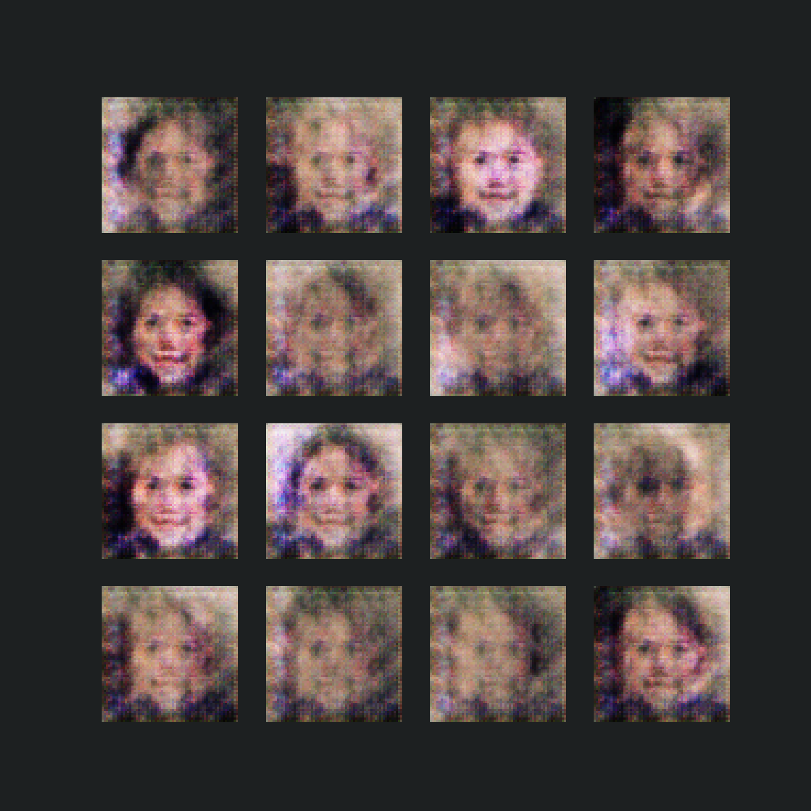
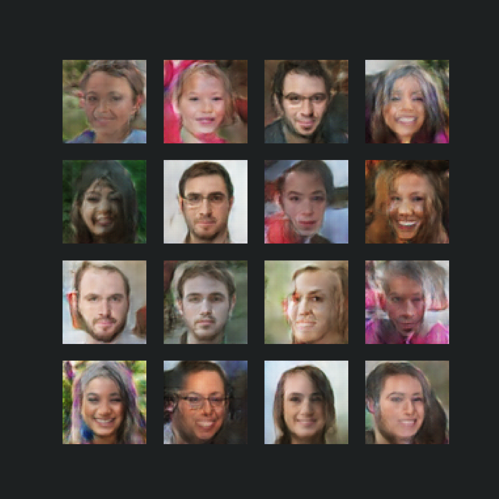
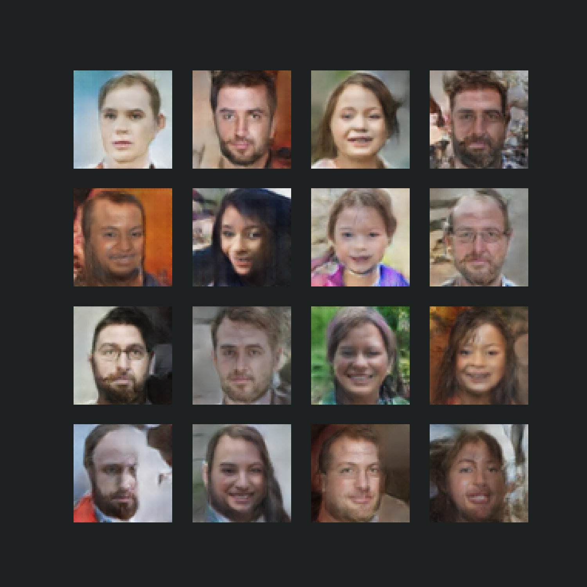

# Male-Female Face Generator (DCGAN)

---
## Tech Stack

---
## Introduction

---
## Implementation

---
This is the **test** branch for this repo.
The following steps are to be followed to run this repo:
1. Run the bash script.
    ```bash
    $ ./bashScript.sh
    ```
   This will download the image dataset and unzip it into the `dataset` directory.
2. Run the `main.py` script. This takes a number of arguments including:
    ```
    - figsize: image size for generated images (Default: 5 X 5)
    - lr: speed of convergence (Default: 1e-4)
    - data_dir: Dataset directory
    - image_dir: Directory to save generated images
    - stats: image normalization statistics
    ```
   ...amongst others.
3. 
---
## Results

Training began from noise like this:


... to more satisfactory results.


Said results are displayed below:

---

Epoch 1:


---
Epoch 10:


---
Epoch 20:


---
Epoch 30:


---
Epoch 40:


---
Epoch 50:


---

All results obtained above were obtained via training with the code snippet below:
```bash
cd scripts
python main.py --epochs 50 --lr 2e-4 --decay_rate .001 --style solarizedd
```
## To-Dos

---
There are still a few additions to make to the project. They include:
1. Improve documentation.
2. Implement training via **noisy labels**.
3. Try out other GAN variants.

